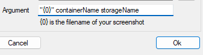

# Store your screenshots in the Cloud
This script is used to automatically upload screenshots/images in your clipboard to Azure blob storage and return the endpoint url to your clipboard

I enjoy taking notes on obsidian.md which saves all image attachments locally making it hard to organize. My website also uses my notes in markdown to create static pages. Having the images already optimized helps with load speeds.

## Usage
I pair this script with [Greenshot](https://getgreenshot.org/), a third-party screenshotting software, to automatically upload the screenshots as soon as I make them. Greenshot saves the image to your clipboard then passes the image + name to an exe version of the script to upload. 

The script saves the url of the cloud endpoint paste or share.

You can set hotkeys to run the script or compile the script into an exe with [PS2exe](https://github.com/MScholtes/PS2EXE) to integrate with Greenshot like I did.


# Getting Started
### Azcopy
You need this to save the images to blob storage. Download [here](https://docs.microsoft.com/en-us/azure/storage/common/storage-use-azcopy-v10). To use the script in it's condition I added azcopy as a PATH environment variable. 

You will have to run azcopy and authenticate with your Azure ID or optionally append a SAS token to the script. Documentation [here](https://docs.microsoft.com/en-us/azure/storage/common/storage-use-azcopy-v10)

### cwebp
This is used to convert  the screenshots to webp. Created and maintained by google you can download it [here](https://developers.google.com/speed/webp/download)
### Parameters
- imgName - sets the file name
- container - the container name in the storage account (created if one doesn't exist)
- storageName - storage account name in Azure
Sample usage for normal clipboard upload
```powershell
./clipboard_upload.ps1 "imgName.png" "test" "storageName"
```

### Setup with GreenShot
Add a new external plugin to be the exe file


Setup your arguments to pass like this



Set up the destination to save to clipboard and then pass it on to the external plugin


